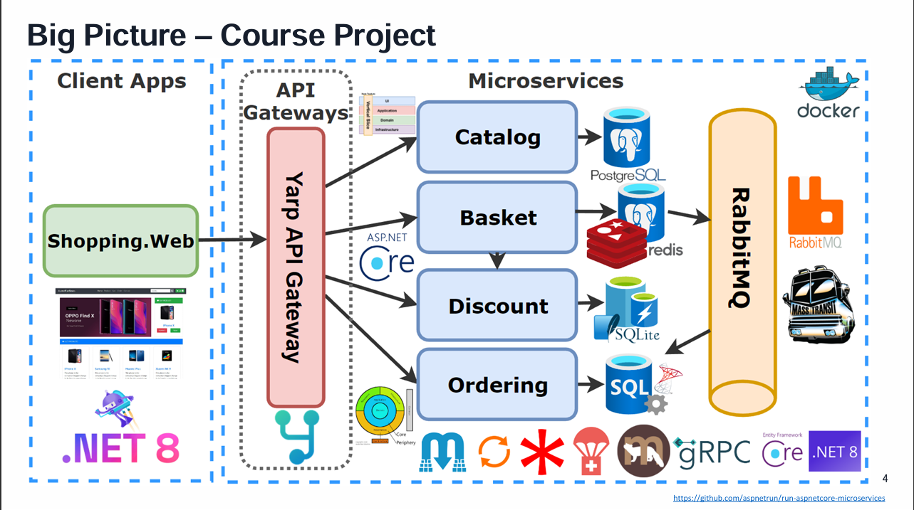
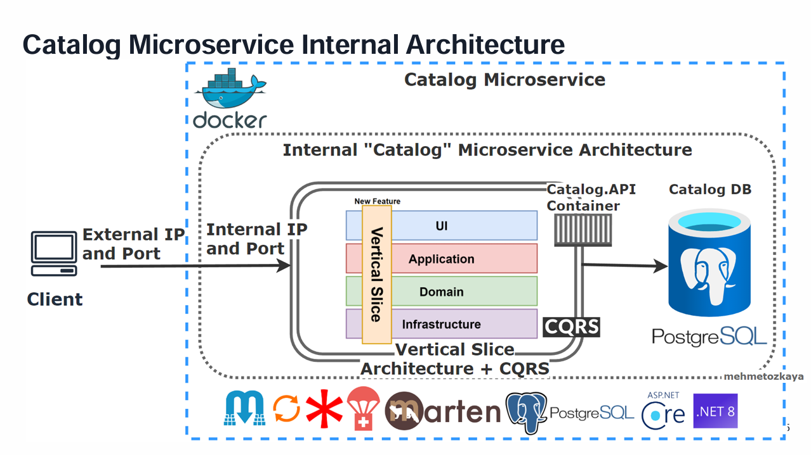
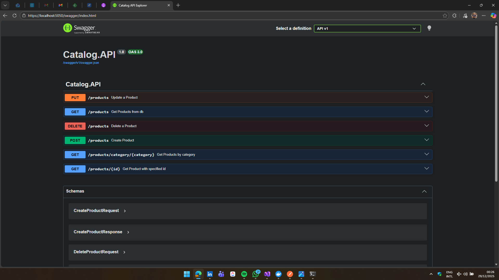

# 🚀 Microservice Course System: E-Shop Microservices
Welcome 👋🏻! This repository contains the code for the E-Shop Microservices system, a comprehensive e-commerce platform built using microservices architecture. The system is designed to demonstrate best practices in software development, including Clean Architecture, Domain-Driven Design (DDD), Command Query Responsibility Segregation (CQRS), and more.

# 🧩 Project Structure
The project will be splitted into many different microservices, each one responsible for a specific domain within the ecosystem. The microservices will communicate with each other using RESTful APIs and message brokers to ensure scalability and maintainability.

Bellow is a diagram explaining the system final structure:

<!-- LEMBRAR  DE ATUALIZAR SEMPRE QUE ADICIONAR UM NOVO SERVIÇO OU DISPONIBILIZAR UMA NOVA VERSÃO -->

# 🐇 How to run the application
## 🐋 Docker Only
At the current state, the only avaliable service is `Catalog.API` service. To run it, you must run a `docker-compose up` command [at this docker-compose.yml](./src/docker-compose.yml), to run the documental DB for catalog API, and then run this [Dockerfile](./src/Services/Catalog/Catalog.API/Dockerfile)

## 🌐 Https
The other alternative, is running a `docker-compose up` command [at this docker-compose.yml](./src/docker-compose.yml), to run the documental DB for catalog API, and then run `dotnet run` [here](./src/Services/Catalog/Catalog.API)

# 🧩 System Components
The E-Shop Microservices system consists of multiple microservices and utility blocks, each serving a specific purpose:

## 🚜 Building Blocks
**Common**: Contains shared utilities, extensions, and base classes used across multiple microservices. It's responsible for abstracting architectural 
actions and cross-cutting concerns to decoupling the repository from libraries, making it able to change dependencies with minor risks.

## 🧸 Catalog Microservice
### 📝 Summary:
The main entry point for the Catalog microservice, handling HTTP requests and responses for handling product-related operations, such as adding, updating, and retrieving product information.

### 🏠 Architecture
The project is designed and stryctured by using the Vertical Sliced Architecture (VSA), which organizes the codebase around features or vertical slices, rather than traditional layers. Each slice contains all the necessary components (e.g., client interface models, services, database communication) to handle a specific feature or functionality.

It also uses the CQRS pattern to separate read and write operations in a logical way, segreggating the read as Query operations, and the Write as Command operations, improving performance and scalability.

### 🧠 Data Storage
The Catalog microservice is also designed to use a NoSQL Documental Database, using Marten as the data access library, which provides a flexible schema and allows for easy scaling of product data, avaliable using the docker-compose file

<!-- 
LEMBRAR  DE ATUALIZAR A SEÇÃO DE "COMO RODAR" SEMPRE QUE ADICIONAR UM NOVO SERVIÇO OU DISPONIBILIZAR UMA NOVA VERSÃO
-->

# 🌹 Swagger UI
The swagger UI is avaliable at `{url}/swagger`, containing all infos about the avaliable endpoints for each service.

Swagger UI for Catalog.API